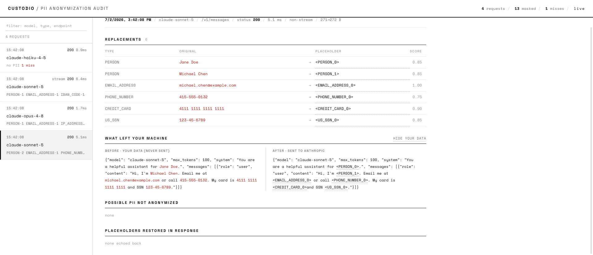

# Custodio

**A transparent PII-anonymizing reverse proxy for the Anthropic API.**

[](https://github.com/lboquillon/custodio/actions/workflows/ci.yml)
[](LICENSE)


Custodio sits between any Anthropic client (Claude Code, the SDK, a script) and
`api.anthropic.com`. It removes personal information from everything you send and
puts it back in everything you receive — so the model works with realistic
placeholders while you keep reading and writing real data. A built-in dashboard
shows you exactly what was hidden, on every request.

```
you send:            email Jane Doe at jane@acme.com
Anthropic receives:  email <PERSON_0> at <EMAIL_ADDRESS_0>
Anthropic replies:   Sent to <PERSON_0> at <EMAIL_ADDRESS_0>.
you receive:         Sent to Jane Doe at jane@acme.com.
```



---

## Contents

- [What you need to know first](#what-you-need-to-know-first)
- [Quick start (choose one)](#quick-start-choose-one)
  - [Option A — Docker (easiest)](#option-a--docker-easiest)
  - [Option B — without Docker](#option-b--without-docker)
- [Point your app at Custodio](#point-your-app-at-custodio)
- [The dashboard](#the-dashboard)
- [Detection engines](#detection-engines)
- [Configuration](#configuration)
- [Security](#security)
- [Deployment and releases](#deployment-and-releases)
- [For developers](#for-developers)
- [How it works](#how-it-works)
- [Limitations](#limitations)
- [License](#license)

---

## What you need to know first

- **You do not need an Anthropic API key** to use Custodio itself. It simply
  forwards whatever your app already uses (a Claude Pro/Max subscription login or
  an API key) to Anthropic, untouched.
- **Custodio runs on your machine.** Your real data never leaves it un-hidden.
- **It does not change how you use Claude.** You point your app at Custodio with
  one setting and keep working exactly as before.
- Anonymization is thorough but **not a 100% guarantee** — see
  [Limitations](#limitations). The dashboard shows you what was and wasn't hidden.

---

## Quick start (choose one)

Pick **one** of the two options below. Option A (Docker) is the easiest and is
recommended if you are not a developer.

### Option A — Docker (easiest)

**Step 1. Install Docker Desktop** (a free app), if you don't have it:
<https://www.docker.com/products/docker-desktop/>. Open it once so it's running
(you'll see a whale icon in your menu bar / system tray).

**Step 2. Open a terminal** and run this single line:

```bash
docker run --pull=always -p 127.0.0.1:3000:3000 ghcr.io/lboquillon/custodio:latest
```

The first run downloads the image (a few hundred MB, one time). When you see a
line like `listening on http://0.0.0.0:3000`, it's ready. Leave this window open.

> The `ghcr.io/...` image is published automatically on each release. If it
> isn't available yet, use the "full setup" box below (`git clone` +
> `docker compose up`), which builds it locally.

**Step 3. Check it's working.** Open <http://localhost:3000/custodio/dashboard>
in your browser — you should see the Custodio dashboard (empty until you send a
request). That's it. Now jump to [Point your app at Custodio](#point-your-app-at-custodio).

> **Want the full setup with a saved history (Redis) and live dashboard across
> restarts?** Instead of the command above, download this project and run:
>
> ```bash
> git clone https://github.com/lboquillon/custodio.git
> cd custodio
> docker compose up
> ```
>
> This starts Custodio **and** a Redis database together, with one command.

### Option B — without Docker

This uses [`uv`](https://docs.astral.sh/uv/), a tool that creates an isolated
environment and fetches the right Python for you — so you don't have to install
Python or anything else by hand.

**Step 1. Install `uv`** (one line):

```bash
# macOS / Linux
curl -LsSf https://astral.sh/uv/install.sh | sh
# Windows (PowerShell)
powershell -c "irm https://astral.sh/uv/install.ps1 | iex"
```

**Step 2. Download the project and start it** (one command; it installs
everything the first time, which takes a couple of minutes):

```bash
git clone https://github.com/lboquillon/custodio.git
cd custodio
make run
```

**Step 3. Check it's working.** Open <http://localhost:3000/custodio/dashboard>.

> `make run` uses the full, most accurate standard detection model
> (`en_core_web_lg`). For the highest possible accuracy use `make run-max`
> (a heavier transformer model); for a fast, minimal install use `make run-regex`.

---

## Point your app at Custodio

Custodio is now listening on `http://localhost:3000`. Tell your Anthropic app to
use it by setting **one** environment variable, then use the app normally.

**Claude Code:**

```bash
export ANTHROPIC_BASE_URL=http://localhost:3000
claude
```

You do **not** need to set an API key — your existing Claude login keeps working.

**Anthropic SDK (Python) or any client:**

```bash
export ANTHROPIC_BASE_URL=http://localhost:3000
```

Now send a message that contains personal details, for example:

> Draft a reply to jane@acme.com confirming the server at 192.168.1.50 is back
> up. My callback number is 415-555-0132.

Anthropic only ever sees `<EMAIL_ADDRESS_0>`, `<IP_ADDRESS_0>`, and
`<PHONE_NUMBER_0>`; your reply comes back with the real values restored. Watch it
happen live on the dashboard.

---

## The dashboard

Open <http://localhost:3000/custodio/dashboard>. It updates **live** as requests
flow through — no refresh needed. For each request you can see:

- every value that was replaced (type, original, placeholder, confidence);
- the exact text that was sent to Anthropic, side by side with your original;
- **possible misses** — a second, lower-confidence scan that flags likely PII
  which scored below the threshold and was therefore *not* hidden (so you know
  what to double-check);
- status, timing, and which placeholders came back in the response.

Link straight to one request with `?event=<id>`. The dashboard's fonts are
served by Custodio itself — it never calls out to a font CDN.

Other endpoints: `GET /custodio/health` (status), `GET /custodio/events`,
`GET /custodio/events/{id}`, `GET /custodio/stats`, `GET /custodio/stream` (live
feed).

---

## Detection engines

Custodio ships with full **named-entity recognition** and uses it by default.

| Engine | How to select | Detects | Notes |
|--------|---------------|---------|-------|
| **`presidio`** (default) | `make run`, or `CUSTODIO_ENGINE=presidio` | Names, locations, organizations (spaCy NER) **plus** emails, phones, cards, SSNs, IPs, IBANs, and more (regex + checksums) | Recommended. Uses `en_core_web_lg` for strong recall. |
| **transformer** | `make run-max`, or install `[transformers]` + `CUSTODIO_SPACY_MODEL=en_core_web_trf` | Same categories, highest accuracy | Heaviest (pulls in a transformer model). Best coverage. |
| **`regex`** | `make run-regex`, or `CUSTODIO_ENGINE=regex` | Emails, phones, cards, SSNs, IPs, IBANs, and a simple name heuristic | No spaCy; smallest/fastest. **Lower recall** — will miss names without an obvious pattern. Use only where you can't run spaCy. |

By default the original values are **masked** in the audit log
(`j••@acme.com`). Set `CUSTODIO_STORE_FULL_PII=true` only for local debugging.

---

## Configuration

All settings are environment variables (see [`.env.sample`](.env.sample)). All
are optional; defaults are shown.

| Variable | Default | Description |
|----------|---------|-------------|
| `CUSTODIO_ENGINE` | `presidio` | Detection engine: `presidio` (full NER) or `regex` |
| `CUSTODIO_UPSTREAM` | `https://api.anthropic.com` | Where real traffic goes |
| `CUSTODIO_HOST` / `CUSTODIO_PORT` | `127.0.0.1` / `3000` | Bind address and port |
| `CUSTODIO_SPACY_MODEL` | `en_core_web_lg` | spaCy model (`en_core_web_sm` = smaller, `en_core_web_trf` = highest accuracy) |
| `CUSTODIO_SCORE_THRESHOLD` | `0.5` | Minimum confidence to anonymize |
| `CUSTODIO_SHADOW_THRESHOLD` | `0.3` | Lower bound for "possible miss" reporting |
| `CUSTODIO_ALLOWED_ENTITIES` / `CUSTODIO_DENIED_ENTITIES` | all / none | Restrict or exclude entity types |
| `CUSTODIO_ANONYMIZE_SYSTEM` | `true` | Anonymize the system prompt |
| `CUSTODIO_ANONYMIZE_TOOL_INPUTS` | `true` | Anonymize tool inputs and tool results |
| `CUSTODIO_ANONYMIZE_TOOL_DEFS` | `false` | Anonymize tool descriptions/schemas (can break tools) |
| `CUSTODIO_ANONYMIZE_METADATA` | `true` | Anonymize `metadata.user_id` |
| `CUSTODIO_STORE_FULL_PII` | `false` | Keep clear-text values in the audit log (debug only) |
| `CUSTODIO_AUDIT_CAPACITY` | `500` | Retained audit events |
| `CUSTODIO_AUDIT_JSONL` | none | Append every finalized event to a JSONL file |
| `CUSTODIO_REDIS_URL` | none | Persist audit events + live pub/sub in Redis |
| `CUSTODIO_REDIS_PREFIX` / `CUSTODIO_REDIS_TTL_SECONDS` | `custodio` / `0` | Redis namespace / per-event expiry |
| `CUSTODIO_AUDIT_TOKEN` | none | Require this token for the dashboard/audit endpoints |
| `CUSTODIO_MAX_BODY_BYTES` | `26214400` | Reject request bodies larger than this (0 = no limit) |
| `CUSTODIO_FAIL_OPEN` | `false` | On engine failure or an unreadable body: block (`false`) or forward raw (`true`) |
| `CUSTODIO_TIMEOUT_SECONDS` | `600` | Upstream request timeout |

---

## Security

Custodio is a privacy tool — run it accordingly.

- **Fails closed by default.** If the detection engine can't load, or a request
  body can't be read as plain JSON (e.g. it's compressed), Custodio refuses to
  forward it rather than leaking un-hidden data. Keep `CUSTODIO_FAIL_OPEN=false`.
- **Protect the dashboard.** The `/custodio/*` endpoints reveal the exact text
  sent upstream. Set `CUSTODIO_AUDIT_TOKEN=<a long random string>` and then open
  the dashboard as `http://localhost:3000/custodio/dashboard?token=<that value>`.
  The provided Docker setup also binds to `127.0.0.1` (localhost) only.
- **Credentials pass through untouched** and are never logged.

See [SECURITY.md](SECURITY.md) for the full policy and how to report issues.

---

## Deployment and releases

- **Docker image:** every tagged release publishes a `linux/amd64` image to the
  GitHub Container Registry: `ghcr.io/lboquillon/custodio:<version>` and
  `:latest` (that's the `docker run` command in
  [Option A](#option-a--docker-easiest)). **One-time:** GHCR packages start
  *private* — after the first release, set the package visibility to **Public**
  (GitHub → the package → Package settings) so anyone can pull it without logging
  in. Apple-silicon users can build a native image with `docker compose up --build`.
- **Python package:** released to PyPI as `custodio`. The base install is
  dependency-light (regex engine only), so for full spaCy detection install the
  extra and a model:

  ```bash
  pip install "custodio[full]"
  python -m spacy download en_core_web_lg
  custodio serve                       # full NER
  # or, without spaCy:
  pip install custodio && custodio serve --engine regex
  ```
- **Automation:** [GitHub Actions](.github/workflows) run linting and tests on
  every push and pull request (`ci.yml`), and on a version tag build the Docker
  image, publish to PyPI, and cut a GitHub Release (`release.yml`).

Cutting a release:

```bash
git tag v1.0.0
git push origin v1.0.0
```

(The GHCR image is pushed automatically; make the package Public once, as noted
above, for anonymous pulls. PyPI publishing is opt-in — set the repo variable
`PUBLISH_TO_PYPI=true` after configuring a PyPI trusted publisher.)

---

## For developers

```bash
make test     # run the test suite (no spaCy model needed; uses a mock upstream + fakeredis)
make lint     # ruff
make run      # full spaCy NER on :3000
make docker   # production container + Redis via docker compose
```

Versioning follows [SemVer](https://semver.org/); changes are recorded in
[CHANGELOG.md](CHANGELOG.md).

Project layout:

```
custodio/
  cli.py               command-line entry point (custodio serve)
  config.py            settings from environment
  operators.py         reversible InstanceCounter anonymize/deanonymize operators
  pii.py               Presidio wrapper: detect, anonymize, shadow-scan
  regex_engine.py      dependency-light regex + checksum engine (no spaCy)
  anthropic_payload.py which request/response fields to transform
  streaming.py         placeholder-safe SSE de-anonymizer
  audit.py             pluggable audit store (memory / Redis) + live EventBus
  dashboard.py         self-contained live dashboard (HTML/CSS/JS)
  assets/              self-hosted dashboard fonts (SIL OFL)
  proxy.py             FastAPI reverse proxy, audit API, and SSE feed
```

---

## How it works

```
  Claude Code / SDK / your app
        |  ANTHROPIC_BASE_URL=http://localhost:3000
        v
  +---------------------------------------------------------------+
  |                        CUSTODIO PROXY                          |
  |  1. Parse the Anthropic request; find the natural-language     |
  |     spans (system prompt, messages, tool inputs/results,      |
  |     documents). Structural/schema fields are left alone.      |
  |  2. Detect PII (spaCy NER + regex/checksums).                 |
  |  3. Replace each value with a stable placeholder (<PERSON_0>) |
  |     and record a per-request mapping.                         |
  |  4. Record an audit event (what was hidden, what might be     |
  |     missed) and push it to the live dashboard.               |
  |  ------------------  forward to api.anthropic.com  ---------- |
  |  5. Put the real values back in the response — inline for     |
  |     JSON, and with a placeholder-safe buffer for streaming.   |
  +---------------------------------------------------------------+
        v
  api.anthropic.com   (only ever sees <PERSON_0>, never "Jane Doe")
```

The mapping lives for exactly one request/response cycle — no database, no
session state, no PII retained between requests. Full rationale in
[DESIGN.md](DESIGN.md).

---

## Limitations

- **Detection is recall-limited.** Some PII can pass through. The "possible
  misses" pass and the anonymized-payload preview help you see this, but nothing
  guarantees complete coverage. Custodio reduces exposure; it is not a guarantee.
- **The model must echo placeholders verbatim** for restoration to fire. LLMs do
  this reliably, but a rewritten placeholder won't be restored.
- **Opaque placeholders** (`<PERSON_0>`) are used because they round-trip more
  reliably than fake-name surrogates.

---

## License

MIT — see [LICENSE](LICENSE). Bundled fonts are under the SIL Open Font License
(see [`custodio/assets/OFL.txt`](custodio/assets/OFL.txt)).

## Author

Leonardo Boquillon. Writing at [leoinai.substack.com](https://leoinai.substack.com/).
